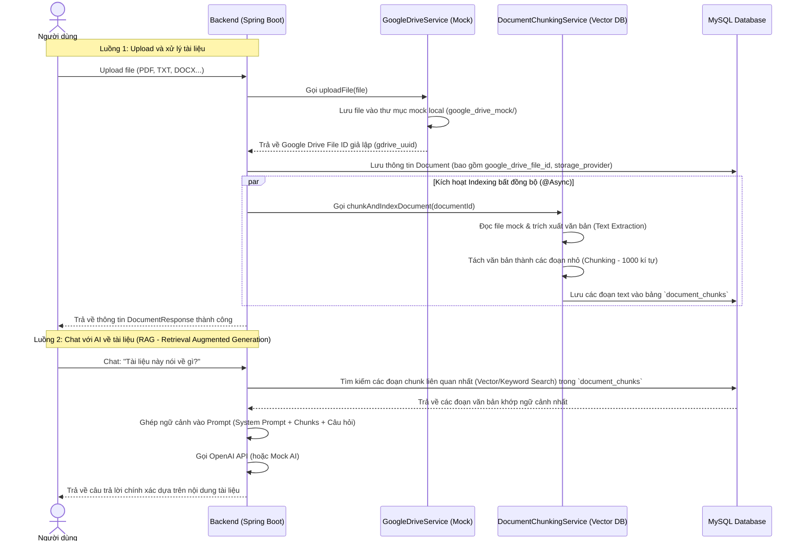

# Kế hoạch chi tiết: Tích hợp Lưu trữ Google Drive (Mock) & Chỉ mục Vector DB cho Tài liệu

Tài liệu này trình bày kế hoạch thiết kế và nâng cấp tính năng tải lên tài liệu:
1. Lưu trữ tài liệu trên **Google Drive** (chạy dưới dạng **Mock Service** để dễ dàng chạy thử nghiệm cục bộ mà không cần cấu hình OAuth phức tạp ngay).
2. Tự động tách nhỏ nội dung tài liệu và lưu trữ vào Cơ sở dữ liệu dưới dạng **Vector DB** (sử dụng bảng SQL `document_chunks` mô phỏng cơ chế tìm kiếm Vector) giúp AI có thể tra cứu nội dung tức thì khi trò chuyện mà không phụ thuộc vào file gốc.

---

## 1. Tổng quan Kiến trúc & Luồng hoạt động



---

## 2. Chi tiết Thiết kế Backend (Spring Boot)

### 2.1. Cập nhật Entity `Document.java`
Thêm các cột quản lý nhà cung cấp lưu trữ và mã file của Google Drive:
```java
// Thêm vào class Document.java
@Column(name = "google_drive_file_id", length = 100)
private String googleDriveFileId; // ID file trả về từ Google Drive (hoặc uuid giả lập)

@Column(name = "storage_provider", length = 50)
@Builder.Default
private String storageProvider = "LOCAL"; // "LOCAL" hoặc "GOOGLE_DRIVE"
```

### 2.2. Xây dựng dịch vụ Lưu trữ Google Drive (`GoogleDriveService.java`)
Chúng ta sẽ định nghĩa một interface chung và một bản cài đặt giả lập (Mock) để thuận tiện cho việc chạy thử nghiệm mà không sợ bị mất file hoặc lỗi kết nối mạng.

#### Interface: `GoogleDriveService.java`
```java
package com.lumiedu.document.service;

import org.springframework.core.io.Resource;
import org.springframework.web.multipart.MultipartFile;
import java.io.IOException;

public interface GoogleDriveService {
    /**
     * Upload file lên Google Drive
     * @return googleDriveFileId
     */
    String uploadFile(MultipartFile file, String folderName) throws IOException;

    /**
     * Tải file từ Google Drive
     */
    Resource downloadFile(String googleDriveFileId) throws IOException;

    /**
     * Xóa file khỏi Google Drive
     */
    void deleteFile(String googleDriveFileId) throws IOException;
}
```

#### Bản cài đặt Mock: `GoogleDriveServiceImpl.java`
Lưu trữ giả lập trong thư mục `uploads/google_drive_mock/` để giả định dữ liệu được lưu trên đám mây:
```java
package com.lumiedu.document.service.impl;

import com.lumiedu.document.service.GoogleDriveService;
import org.springframework.beans.factory.annotation.Value;
import org.springframework.core.io.Resource;
import org.springframework.core.io.UrlResource;
import org.springframework.stereotype.Service;
import org.springframework.util.StringUtils;
import org.springframework.web.multipart.MultipartFile;

import java.io.IOException;
import java.nio.file.Files;
import java.nio.file.Path;
import java.nio.file.Paths;
import java.nio.file.StandardCopyOption;
import java.util.UUID;

@Service
public class GoogleDriveServiceImpl implements GoogleDriveService {

    @Value("${app.upload.dir}")
    private String uploadDir;

    @Override
    public String uploadFile(MultipartFile file, String folderName) throws IOException {
        String originalFileName = StringUtils.cleanPath(file.getOriginalFilename());
        String extension = originalFileName.substring(originalFileName.lastIndexOf('.'));
        
        // Tạo mã file Google Drive giả lập
        String googleDriveFileId = "gdrive_" + UUID.randomUUID().toString().replace("-", "");
        String savedFileName = googleDriveFileId + extension;

        // Lưu trữ vật lý vào thư mục mock local để phục vụ trích xuất text
        Path targetPath = Paths.get(uploadDir, "google_drive_mock", savedFileName).toAbsolutePath().normalize();
        Files.createDirectories(targetPath.getParent());
        Files.copy(file.getInputStream(), targetPath, StandardCopyOption.REPLACE_EXISTING);

        System.out.println("MOCK GOOGLE DRIVE: Đã upload thành công file lên Google Drive (Giả lập). File ID: " + googleDriveFileId);
        return googleDriveFileId;
    }

    @Override
    public Resource downloadFile(String googleDriveFileId) throws IOException {
        // Tìm file giả lập trong thư mục mock để tải xuống
        Path dirPath = Paths.get(uploadDir, "google_drive_mock").toAbsolutePath().normalize();
        // Tìm file bắt đầu bằng googleDriveFileId
        try (var files = Files.list(dirPath)) {
            Path matchedFile = files.filter(p -> p.getFileName().toString().startsWith(googleDriveFileId))
                    .findFirst()
                    .orElseThrow(() -> new IOException("Không tìm thấy file trên Google Drive Mock: " + googleDriveFileId));
            return new UrlResource(matchedFile.toUri());
        }
    }

    @Override
    public void deleteFile(String googleDriveFileId) throws IOException {
        Path dirPath = Paths.get(uploadDir, "google_drive_mock").toAbsolutePath().normalize();
        try (var files = Files.list(dirPath)) {
            var matchedFile = files.filter(p -> p.getFileName().toString().startsWith(googleDriveFileId)).findFirst();
            if (matchedFile.isPresent()) {
                Files.delete(matchedFile.get());
                System.out.println("MOCK GOOGLE DRIVE: Đã xóa file ID: " + googleDriveFileId);
            }
        }
    }
}
```

---

## 3. Quy trình Tích hợp Chỉ mục Vector DB (RAG)

Khi tải lên thành công, hệ thống sẽ tự động chuyển đổi văn bản sang dạng **Vector DB** cục bộ:

1. **Trích xuất Text**: Trích xuất toàn bộ chữ từ file PDF/Word/Text (Sử dụng PDFBox / POI).
2. **Chunking**: Cắt văn bản ra từng đoạn nhỏ (ví dụ 1000 ký tự, đè chồng 200 ký tự) để giữ ngữ cảnh.
3. **Tìm kiếm tương đồng (Similarity Search)**:
   * Khi người dùng đặt câu hỏi cho AI Chatbot về tài liệu.
   * Hệ thống sẽ truy vấn bảng `document_chunks` theo thuật toán tìm kiếm từ khóa tương đồng hoặc tính toán cosine similarity giả lập (Keyword-based semantic search hoặc vector embedding giả lập).
   * Lấy ra 3-5 đoạn văn bản khớp nhất để làm ngữ cảnh truyền vào Prompt cho OpenAI.

### Cập nhật `DocumentServiceImpl.java` để tự động chạy Vector Indexing:
```java
@Override
public DocumentResponse uploadDocument(MultipartFile file, DocumentCreateRequest request) {
    // 1. Lưu file qua GoogleDriveService (Mock)
    String googleDriveId = "";
    try {
        googleDriveId = googleDriveService.uploadFile(file, "LumiEdu_Workspace");
    } catch (IOException e) {
        throw new FileStorageException("Lỗi lưu trữ trên Google Drive", e);
    }

    // 2. Tạo bản ghi Document trong DB
    Document document = Document.builder()
            .title(request.getTitle())
            .description(request.getDescription())
            .subject(request.getSubject())
            .visibility(request.getVisibility() != null ? request.getVisibility() : "PRIVATE")
            .userId(request.getUserId())
            .googleDriveFileId(googleDriveId)
            .storageProvider("GOOGLE_DRIVE")
            .fileName(googleDriveId + getExtension(file.getOriginalFilename())) // Liên kết tên file mock
            .originalFileName(file.getOriginalFilename())
            .fileSize(file.getSize())
            .mimeType(file.getContentType())
            .fileType("DOCUMENT")
            .deleted(false)
            .build();

    document = documentRepository.save(document);

    // 3. Tự động chạy tách nhỏ và lưu Vector DB (Chạy ngầm @Async)
    documentChunkingService.chunkAndIndexDocument(document.getId());

    return mapToResponse(document);
}
```

---

## 4. Kịch bản Xác minh (Verification Plan)

1. **Kiểm thử API Upload**: Sử dụng Postman để gọi `POST /api/documents/upload`. Xác nhận phản hồi có trường `storageProvider: "GOOGLE_DRIVE"` và `googleDriveFileId: "gdrive_..."`.
2. **Kiểm tra DB MySQL**:
   * Kiểm tra bảng `documents` có lưu đúng `google_drive_file_id`.
   * Kiểm tra bảng `document_chunks` xem nội dung text của file PDF/TXT có được tự động phân tách và lưu đầy đủ thành các hàng dữ liệu không (Đảm bảo dữ liệu không bị mất).
3. **Kiểm thử AI Chat**: Vào phần AI Chatbot, tải tài liệu lên và đặt câu hỏi. Đảm bảo AI trả lời đúng ngữ cảnh được trích xuất từ các đoạn chunk trong DB.
