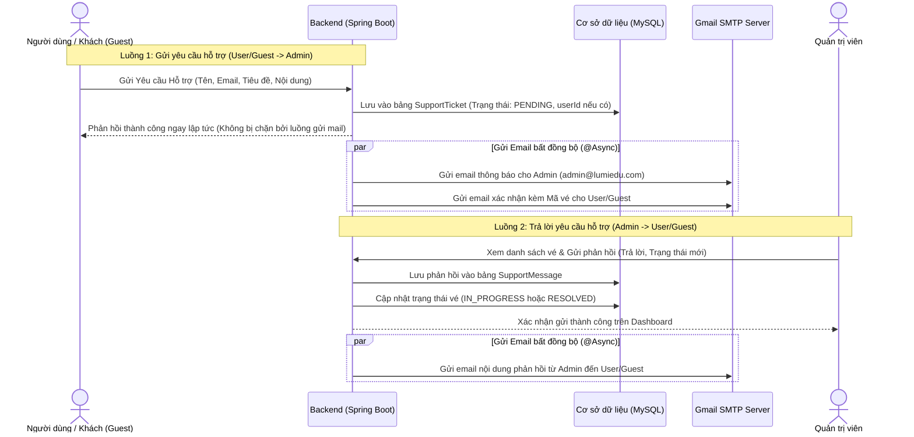

# Kế hoạch chi tiết: Nâng cấp tính năng gửi Email phản hồi hai chiều (User <-> Admin)

Tài liệu này trình bày kế hoạch thiết kế và phát triển tính năng gửi nhận email hỗ trợ giữa Người dùng (User/Guest) và Quản trị viên (Admin) cho hệ thống **AI Study Hub (LumiEdu)**. Tài liệu bao gồm cấu hình chi tiết, cấu trúc dữ liệu và mã nguồn tham khảo đầy đủ để bạn tự triển khai sau này.

---

## 1. Tổng quan Kiến trúc & Luồng hoạt động

Hệ thống hoạt động theo mô hình **Hỗ trợ qua Vé yêu cầu (Ticket-based Support)** kết hợp thông báo Email thời gian thực chạy **bất đồng bộ (@Async)** để tối ưu hiệu năng:



---

## 2. Các thay đổi và Mã nguồn chi tiết ở Backend (Spring Boot)

### 2.1. Cấu hình Maven & Properties

#### Bổ sung thư viện trong `pom.xml`
Cần bổ sung thư viện `spring-boot-starter-mail` để sử dụng dịch vụ gửi thư của Spring:
```xml
<dependency>
    <groupId>org.springframework.boot</groupId>
    <artifactId>spring-boot-starter-mail</artifactId>
</dependency>
```

#### Cấu hình trong `application.properties`
Cấu hình chi tiết sử dụng **Gmail SMTP** và tài khoản test đã tạo:
```properties
# Spring Mail Configuration (Gmail SMTP)
spring.mail.host=smtp.gmail.com
spring.mail.port=587
spring.mail.username=${MAIL_USERNAME:lumieduteam@gmail.com}
# Mật khẩu ứng dụng (App Password) 16 ký tự của Google
spring.mail.password=${MAIL_PASSWORD:xagzjgkcipyihtpw}
spring.mail.properties.mail.smtp.auth=true
spring.mail.properties.mail.smtp.starttls.enable=true
spring.mail.properties.mail.smtp.starttls.required=true
spring.mail.properties.mail.smtp.connectiontimeout=5000
spring.mail.properties.mail.smtp.timeout=3000
spring.mail.properties.mail.smtp.writetimeout=5000

# Application Admin Email Destination (Email nhận tin báo hỗ trợ của Admin)
app.admin.email=${ADMIN_EMAIL:lumieduteam@gmail.com}
```

### 2.2. Kích hoạt xử lý Bất đồng bộ (`@Async`)
Thêm `@EnableAsync` vào lớp khởi chạy ứng dụng:
- **File**: `com.lumiedu.LumiEduApplication`
```java
package com.lumiedu;

import org.springframework.boot.SpringApplication;
import org.springframework.boot.autoconfigure.SpringBootApplication;
import org.springframework.scheduling.annotation.EnableAsync;

@SpringBootApplication
@EnableAsync // Kích hoạt xử lý bất đồng bộ
public class LumiEduApplication {
    public static void main(String[] args) {
        SpringApplication.run(LumiEduApplication.class, args);
    }
}
```

### 2.3. Lớp Dịch vụ Gửi Email (`EmailService.java`)
- **Package**: `com.lumiedu.email.service`
```java
package com.lumiedu.email.service;

import jakarta.mail.internet.MimeMessage;
import lombok.RequiredArgsConstructor;
import org.springframework.beans.factory.annotation.Value;
import org.springframework.mail.javamail.JavaMailSender;
import org.springframework.mail.javamail.MimeMessageHelper;
import org.springframework.scheduling.annotation.Async;
import org.springframework.stereotype.Service;

@Service
@RequiredArgsConstructor
public class EmailService {

    private final JavaMailSender mailSender;

    @Value("${spring.mail.username}")
    private String fromEmail;

    @Async("taskExecutor") // Chạy ngầm không block luồng chính
    public void sendEmail(String to, String subject, String content, boolean isHtml) {
        try {
            MimeMessage message = mailSender.createMimeMessage();
            MimeMessageHelper helper = new MimeMessageHelper(message, true, "UTF-8");
            
            helper.setTo(to);
            helper.setSubject(subject);
            helper.setText(content, isHtml);
            helper.setFrom(fromEmail, "LumiEdu Support");

            mailSender.send(message);
            System.out.println("Email sent successfully to " + to);
        } catch (Exception e) {
            System.err.println("Failed to send email to " + to + ": " + e.getMessage());
        }
    }
}
```

### 2.4. Thiết kế Cơ sở dữ liệu (Entities & Enums)

#### Enum: `TicketStatus.java`
```java
package com.lumiedu.support.enums;

public enum TicketStatus {
    PENDING,      // Chờ xử lý
    IN_PROGRESS,  // Đang xử lý
    RESOLVED,     // Đã giải quyết
    CLOSED        // Đã đóng
}
```

#### Entity 1: `SupportTicket.java`
```java
package com.lumiedu.support.entity;

import com.lumiedu.common.entity.BaseEntity;
import com.lumiedu.support.enums.TicketStatus;
import jakarta.persistence.*;
import lombok.*;

@Entity
@Table(name = "support_tickets")
@Getter
@Setter
@NoArgsConstructor
@AllArgsConstructor
@Builder
public class SupportTicket extends BaseEntity {

    @Id
    @GeneratedValue(strategy = GenerationType.IDENTITY)
    private Long id;

    @Column(nullable = false, length = 100)
    private String name;

    @Column(nullable = false, length = 150)
    private String email;

    @Column(nullable = false, length = 200)
    private String subject;

    @Column(nullable = false, columnDefinition = "TEXT")
    private String message;

    @Enumerated(EnumType.STRING)
    @Column(nullable = false, length = 20)
    private TicketStatus status;

    @Column(name = "user_id")
    private Long userId; // null nếu là Guest
}
```

#### Entity 2: `SupportMessage.java`
```java
package com.lumiedu.support.entity;

import com.lumiedu.common.entity.BaseEntity;
import jakarta.persistence.*;
import lombok.*;

@Entity
@Table(name = "support_messages")
@Getter
@Setter
@NoArgsConstructor
@AllArgsConstructor
@Builder
public class SupportMessage extends BaseEntity {

    @Id
    @GeneratedValue(strategy = GenerationType.IDENTITY)
    private Long id;

    @Column(name = "ticket_id", nullable = false)
    private Long ticketId;

    @Column(name = "sender_email", nullable = false, length = 150)
    private String senderEmail;

    @Column(name = "sender_name", nullable = false, length = 100)
    private String senderName;

    @Column(nullable = false, columnDefinition = "TEXT")
    private String message;

    @Column(name = "is_from_admin", nullable = false)
    private Boolean isFromAdmin;
}
```

### 2.5. Các Lớp Repository
```java
package com.lumiedu.support.repository;

import com.lumiedu.support.entity.SupportTicket;
import com.lumiedu.support.enums.TicketStatus;
import org.springframework.data.jpa.repository.JpaRepository;
import java.util.List;

public interface SupportTicketRepository extends JpaRepository<SupportTicket, Long> {
    List<SupportTicket> findByUserIdOrderByCreatedAtDesc(Long userId);
    List<SupportTicket> findByStatusOrderByCreatedAtDesc(TicketStatus status);
}
```

```java
package com.lumiedu.support.repository;

import com.lumiedu.support.entity.SupportMessage;
import org.springframework.data.jpa.repository.JpaRepository;
import java.util.List;

public interface SupportMessageRepository extends JpaRepository<SupportMessage, Long> {
    List<SupportMessage> findByTicketIdOrderByCreatedAtAsc(Long ticketId);
}
```

### 2.6. Lớp Nghiệp vụ chính (`SupportTicketService.java`)
```java
package com.lumiedu.support.service;

import com.lumiedu.email.service.EmailService;
import com.lumiedu.support.dto.*;
import com.lumiedu.support.entity.*;
import com.lumiedu.support.enums.TicketStatus;
import com.lumiedu.support.repository.*;
import lombok.RequiredArgsConstructor;
import org.springframework.beans.factory.annotation.Value;
import org.springframework.stereotype.Service;
import org.springframework.transaction.annotation.Transactional;

import java.util.List;

@Service
@RequiredArgsConstructor
@Transactional
public class SupportTicketService {

    private final SupportTicketRepository ticketRepository;
    private final SupportMessageRepository messageRepository;
    private final EmailService emailService;

    @Value("${app.admin.email}")
    private String adminEmail;

    public SupportTicket createTicket(SupportTicketRequest request, Long userId) {
        SupportTicket ticket = SupportTicket.builder()
                .name(request.getName())
                .email(request.getEmail())
                .subject(request.getSubject())
                .message(request.getMessage())
                .status(TicketStatus.PENDING)
                .userId(userId)
                .build();

        SupportTicket savedTicket = ticketRepository.save(ticket);

        // 1. Gửi Email thông báo tới Admin (Async)
        String adminHtml = String.format(
                "<h2>Có yêu cầu hỗ trợ mới!</h2>" +
                "<p><strong>Người gửi:</strong> %s (%s)</p>" +
                "<p><strong>Tiêu đề:</strong> %s</p>" +
                "<p><strong>Nội dung:</strong></p>" +
                "<blockquote style='background:#f9f9f9;border-left:5px solid #ccc;padding:10px;'>%s</blockquote>",
                ticket.getName(), ticket.getEmail(), ticket.getSubject(), ticket.getMessage()
        );
        emailService.sendEmail(adminEmail, "LumiEdu - Yêu cầu hỗ trợ mới #" + savedTicket.getId(), adminHtml, true);

        // 2. Gửi Email xác nhận cho User/Guest (Async)
        String userHtml = String.format(
                "<h3>Chào %s,</h3>" +
                "<p>Cảm ơn bạn đã liên hệ với LumiEdu. Chúng tôi đã nhận được yêu cầu hỗ trợ của bạn (Mã vé: <strong>#%d</strong>).</p>" +
                "<p>Đội ngũ hỗ trợ của chúng tôi sẽ phản hồi lại bạn sớm nhất qua email này.</p>",
                ticket.getName(), savedTicket.getId()
        );
        emailService.sendEmail(ticket.getEmail(), "LumiEdu - Xác nhận yêu cầu hỗ trợ #" + savedTicket.getId(), userHtml, true);

        return savedTicket;
    }

    public SupportMessage replyFromAdmin(Long ticketId, String messageContent, String adminName, String adminEmail) {
        SupportTicket ticket = ticketRepository.findById(ticketId)
                .orElseThrow(() -> new RuntimeException("Không tìm thấy Ticket với ID: " + ticketId));

        SupportMessage message = SupportMessage.builder()
                .ticketId(ticketId)
                .senderName(adminName)
                .senderEmail(adminEmail)
                .message(messageContent)
                .isFromAdmin(true)
                .build();

        SupportMessage savedMessage = messageRepository.save(message);

        // Cập nhật trạng thái Ticket
        ticket.setStatus(TicketStatus.IN_PROGRESS);
        ticketRepository.save(ticket);

        // Gửi email phản hồi đến User/Guest (Async)
        String replyHtml = String.format(
                "<h3>Chào %s,</h3>" +
                "<p>Đội ngũ hỗ trợ LumiEdu đã phản hồi về yêu cầu <strong>#%d: %s</strong> của bạn:</p>" +
                "<div style='background:#f4f6f8;border:1px solid #e1e4e6;border-radius:6px;padding:15px;margin:15px 0;white-space:pre-wrap;'>%s</div>" +
                "<p>Trân trọng,<br/><strong>%s</strong> (Ban quản trị LumiEdu)</p>",
                ticket.getName(), ticket.getId(), ticket.getSubject(), messageContent, adminName
        );
        emailService.sendEmail(ticket.getEmail(), "Re: LumiEdu - Phản hồi hỗ trợ #" + ticket.getId(), replyHtml, true);

        return savedMessage;
    }
}
```

---

## 3. Thiết kế luồng xử lý trên Frontend (React)

### 3.1. Đối với User / Guest (Trang Contact Support)
- **Hộp thoại/Form liên hệ:**
  - `Họ và tên` (Input text)
  - `Địa chỉ Email` (Input email)
  - `Tiêu đề` (Input text)
  - `Nội dung chi tiết` (Textarea)
- **Xử lý Autofill (Tự điền):**
  ```typescript
  // React Hook
  const { user, isAuthenticated } = useAuthStore();
  
  useEffect(() => {
    if (isAuthenticated && user) {
      setName(user.fullName);
      setEmail(user.email);
    }
  }, [user, isAuthenticated]);
  ```
  - Nếu đã đăng nhập: Disable trường `Name` và `Email`, chỉ cho phép nhập `Subject` và `Message`.
  - Nếu chưa đăng nhập (Guest): Cho phép nhập toàn bộ, và validate định dạng email bắt buộc trước khi submit.

### 3.2. Đối với Admin (Dashboard Quản trị)
- **Giao diện quản lý vé:**
  - Danh sách vé hiển thị trạng thái (`PENDING`, `IN_PROGRESS`, `RESOLVED`, `CLOSED`).
  - Khi click vào 1 vé, hiển thị hộp thoại chat lịch sử các tin nhắn.
  - Phía dưới có ô nhập tin nhắn và nút **"Gửi Phản hồi & Gửi Email"**. Khi Admin bấm gửi, hệ thống sẽ thực hiện gọi API gửi mail đến cho User/Guest.

---

## 6. Thông tin tài khoản gửi Mail Test (Đã cấu hình)

- **Gmail dùng để gửi & nhận:** `lumieduteam@gmail.com`
- **Mật khẩu ứng dụng (App Password):** `xagz jgkc ipyi htpw` (sử dụng trong file cấu hình properties: `xagzjgkcipyihtpw`)
